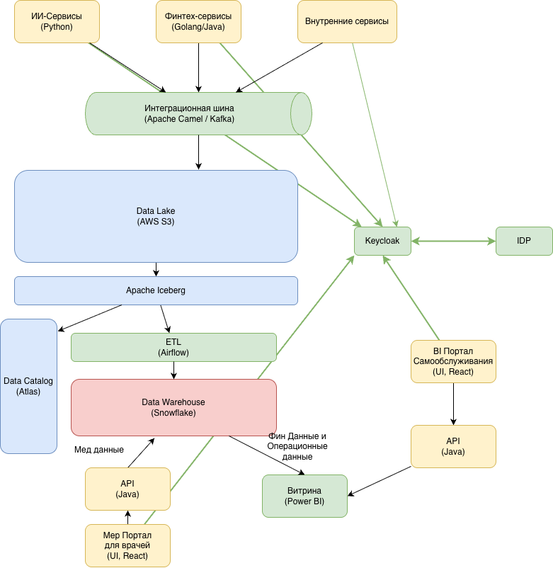

1. Диаграмма "Будущего 2.0" через год 

2. Проблемные места 

| Проблема                                         | Описание                                                                                                     | Бизнес сценарий                                                                                                                                |
|--------------------------------------------------|--------------------------------------------------------------------------------------------------------------|------------------------------------------------------------------------------------------------------------------------------------------------|
| Долгая генерация отчетов                         | Power BI подключен напрямую к устаревшему SQL Server 2008 (DWH), который не соответствует запросам и объемам | Замедляется time-to-market и падает производительность аналитических процессов: формирование сложных отчётов может занимать часы.              |
| Power Builder влияет на масштабируемость системы | PowerBuilder также устаревшая и плохо масштабируемая технология, плохо интегрируется с другими системами     | Плохо расширяется на новые клиники, ограничивает функционал по мед данным                                                                      |
| DWH представляет собой монолит                   | На данный момент DWH хранит все данные без структуризации, без настроек доступа                              | Невозможно разделить данные на домены, а также дополнительно исключить мед карты из аналитики                                                  |
| Нет выделенных доменов                           | Система плохо масштабируется                                                                                 | Бизнесу необходимо иметь возможность быстро добавлять новые направления                                                                        |
| Бизнес-логика в DWH                              | В DWH сосредоточена большая часть бизнес-логики, что требует кодовых изменений на всех уровнях для новых фич | Влияет на скорость добавления нового функционала                                                                                               |
| Система не масштабируема                         | Переезд в облако также рассматривается как способ повысить надёжность и доступность сервисов                 | Бизнесу необходимы механизмы отказоустойчивости, резервного копирования и геораспределённого развёртывания                                     |
| Нет систем мониторинга                           | На данный момент нет контроля за данными                                                                     | Бизнес не выделял это как отдельную цель, но она может быть частью обеспечения информационной безопасности и соблюдения требований регуляторов |

3. Приоритизация по MoSCoW

| Проблема                                         | Приоритет | Описание                                                                                                              |
|--------------------------------------------------|-----------|-----------------------------------------------------------------------------------------------------------------------|
| Долгая генерация отчетов                         | Must      | Влияет на time-to-market -> прямая зависимость дохода                                                                 |
| Power Builder влияет на масштабируемость системы | Should    | Необходимо запланировать переход, но не в первом приоритете, тк на данный момент свою роль выполняет                  |
| DWH представляет собой монолит                   | Should    | Влияет на добавление новых бизнес-сфер. Влияет на долгосрочный доход                                                  |
| Нет выделенных доменов                           | Should    | Влияет на добавление новых бизнес-сфер. Влияет на долгосрочный доход                                                  |
| Бизнес-логика в DWH                              | Must      | Долгая доставка даже не глобальных фич. Может непосредственно влиять на доход, если конкуренты внедрили фичи быстрее. |
| Система не масштабируема                         | Must      | Необходим переезд в облако, тк не позволяет расширять сеть клиник. Прямое влияние на доход                            |
| Нет систем мониторинга                           | Could     | Система на данный момент работает, нет актуальных жалоб на мониторинг. Нет прямого влияния на доход                   |

