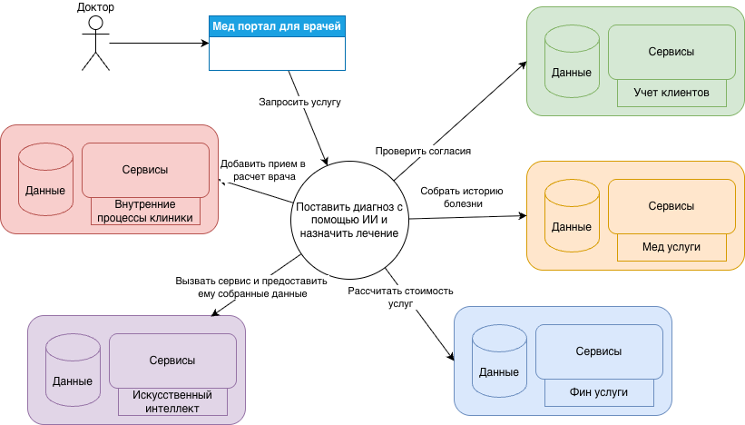

# Разделение системы на домены и моделирование потоков данных для поддержки ключевых бизнес-сценариев

## Разделение системы на домены
- Домен медицинских услуг  
Данный домен необходим, чтобы предоставлять мед услуг клиентам: здесь будет храниться все результаты 
анализов и процедур, результаты осмотров и посещенных врачей. Взаимодействуя с данным доменом можно получить всю историю 
болезни пациента и его рекомендации 
- Домен системы искусственного интеллекта  
ИИ выделен в отдельный домен, так как ему необходима особая бизнес-логика и строго структурированные данные. Плюс, не ко
всем мед картам клиентов должен быть доступ у ИИ  
- Домен финансовых сервисов  
Все банковские и финансовые услуги выделены в отдельный домен для изоляции логики и ограничения доступности данных. 
Сервисам, которые оказывают фин услуги, не нужны данные по истории болезни пациента, но необходим доступ к идентификационным 
данным и кредитной истории клиента
- Домен учета клиентов  
Информация о всех прошлых и текущих клиентах, их представителях, юридические соглашения, договора, персональная информация
- Домен внутренних процессы клиники  
Внутренняя документация, данные по сотрудникам, инвентаризационные данные клиник
- Домен фармацевтических продуктов  
Будущий домен, который будет внедрен после переезда на новую архитектуру. Будет предоставлять услуги по фармацевтическим 
продуктам компании. Домену будет необходима интеграция с доменом внутренних данных клиники, а также доменом ИИ 
- Домен электроники и мед оборудования  
Будущий домен, который будет внедрен после переезда на новую архитектуру. Будет предоставлять услуги по производству мед
оборудованию компании. Домену будет необходима интеграция с доменом внутренних данных клиники, доменом ИИ и с доменом мед 
услуг

## Преимущества выделения доменов 
1. На данный момент все данные и бизнес логика хранятся в одном DWH, что затрудняет организацию и менеджмент: 
- нет команды, ответственной за развитие каждого из направлений 
- нет ограничения доступа к чувствительным данным 
- добавление новых направлений осложнено необходимостью внесения бизнес-логики в DWH
2. Каждый отдельный домен будет иметь изолированную логику и взаимодействовать только с нужными сервисами 
3. Масштабирование каждого отдельного домена будет произведено с учетом реальной нагрузки
4. Проще добавить новый бизнес-процесс, он также будет изолирован и масштабирован 
5. Каждый домен исполняет необходимые требования по защите персональных данных согласно законам
6. Каждый домен может быть модифицирован и выпущен в продакшин без зависимостей на другие домены

## Потоки данных на примере услуги по постановке анализа ИИ 

