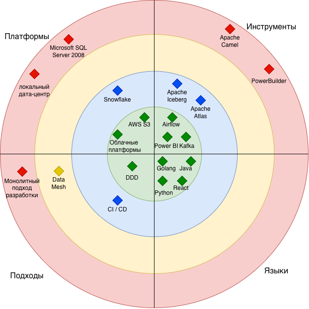
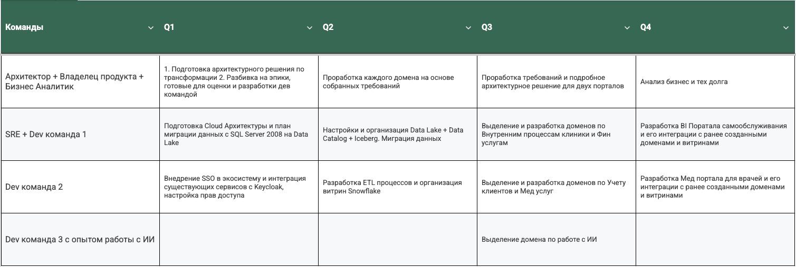

1. Тех Радар

- Локальный дата центр нужно заменить Облачными платформами для поддержания масштабируемости и отказоустойчивости
- SQL Server 2008 заменяется AWS S3 (как озеро неструктурированных данных) + Snowflake (обработанные данные)
- Airflow + Atlas + Iceberg необходимы, чтобы улучшить производительность работы с данными и уменьшить time-to-market
- Устаревшую шину Apache Camel следует заменить на Kafka, но не является перво-приоритетной задачей
- Устаревший PowerBuilder заменится порталом самообслуживания согласно бизнес-реквайроментам 
- По языкам разработки все хорошо, они отвечают современным стандартам
- Необходимо обновить подходы разработки и архитектуры: монолитный подход заменяется на микросервисный с разделением на домены  
для выполнения бизнес-запроса по быстрому расширению экосистемы
- Data Mesh подход позволит навести порядок в данных и использовать их как равный бизнес-продукт 
- CI / CD сделает разработку надежнее и быстрее, чтобы доставлять новые бизнес-фичи на прод 

2. Роадмап на год 

3. Изменения на 4 квартала запланированы согласно требованиям бизнеса: 
- максимально в параллель будет работать 4 команда, одна из которых Core состоит из бизнеса и архитектора
- Core команда работает параллельно в течение всего года, чтобы прорабатывать каждый из эпиков более детально, а также  
редактировать объем и цели согласно реальной скорости и достижениям дев команд 
- необходим sre представитель на протяжении всей миграции для инфраструктурных вопросов и изменений
- sre и одна из дев команд (с соответствующей экспертизой) будут заниматься подготовкой cloud решения и планировать  
переезд из sql server в data lake в течение первого квартала
- вторая dev команда будет в это время заниматься внедрением rbac политик доступа. Эта интеграция необходима как для  
уже существующих сервисов компании, так и для дальнейшего внедрения в обновленную архитектуру
- в течении второго квартала команды будут работать с миграцией данных из старой dwh в новую data lakehouse  
и с подготовкой витрин в Snowflake 
- в третьем квартале необходима отдельная команда с опытом работы с ИИ, которая введет в эксплуатацию домен по работе с ИИ 
- прежние 2 дев команды будут работать со своими доменами в третьем квартале
- в четвертом квартале каждая из 2х дев команд будет работать со своим порталом и интеграциями с доменами

Работа выстроена таким образом, чтобы подготовительная работа (зависимости) выполнялась в "предыдущем" квартале, а  
также по плану должно быть задействовано только 3 дев команды, чтобы они не работали на одним и тех же  
областях в один момент времени. У каждой из команд есть свои домены и зоны ответственности. 