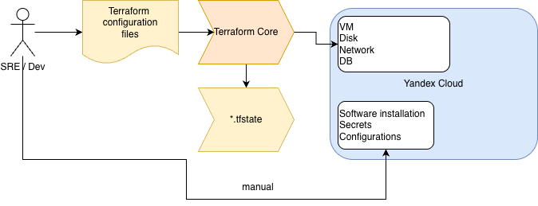
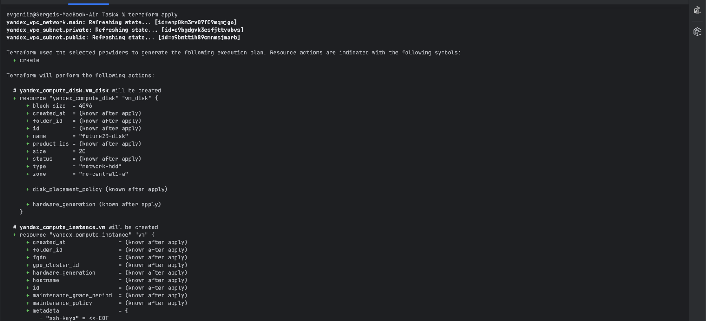
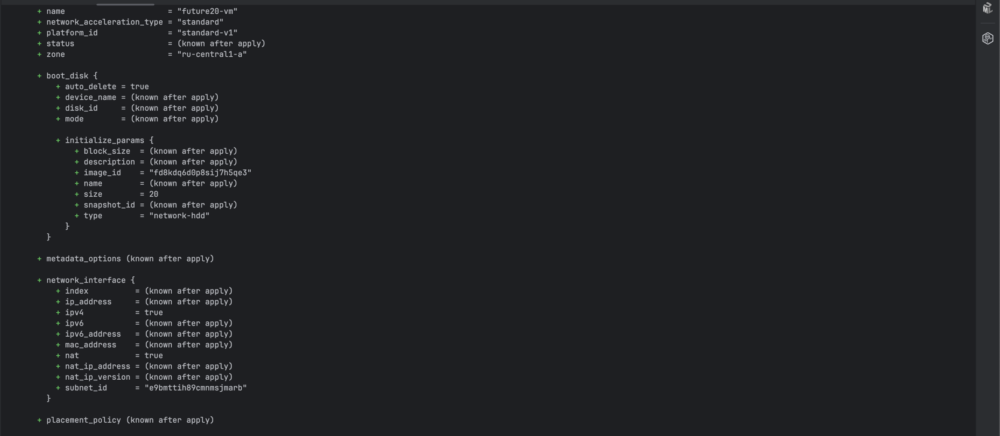
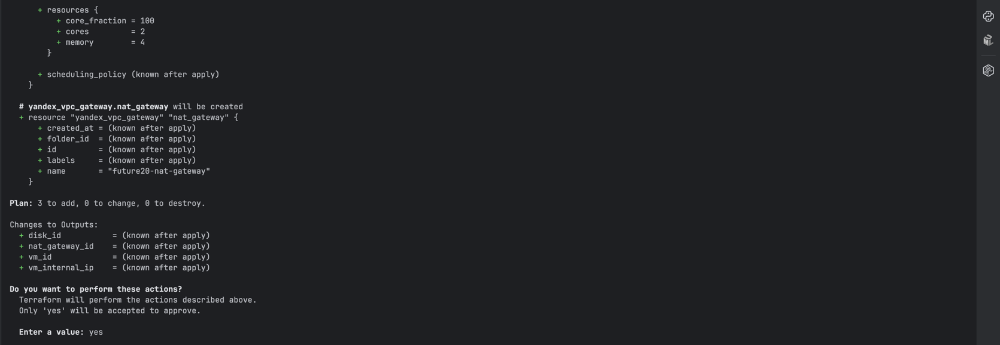
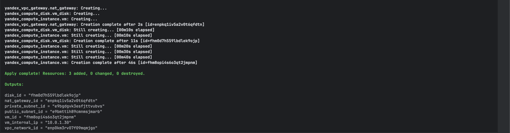
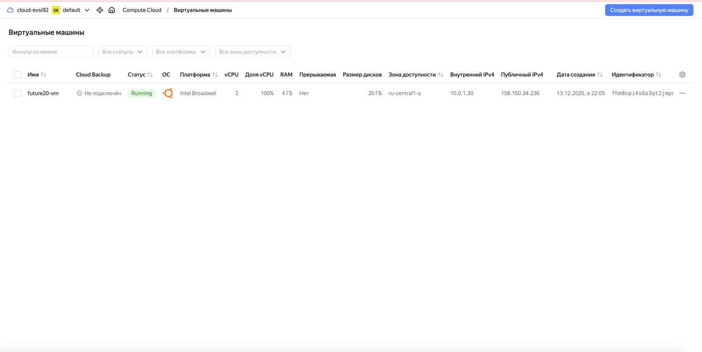

## Обоснование выбора ресурсов

### Виртуальная машина (VM)
- Платформа: standard-v1 обеспечивает стабильную производительность для базовых сервисов и тестовых окружений.
- Размер: 2 vCPU / 4 GB RAM` оптимальный баланс между стоимостью и производительностью. Подходит для пилотных проектов и небольших сервисов.
- Образ: Ubuntu (`fd8kdq6d0p8sij7h5qe3`) надёжный и широко поддерживаемый дистрибутив, удобный для разработки и эксплуатации.

### Диск
- Тип: network-hdd экономичный вариант для хранения данных, не требующих высокой скорости доступа.
- Размер: 20 GB достаточен для базовых приложений, логов и системных файлов. При необходимости легко масштабируется.

## Причины использования декларативного подхода

Terraform работает по принципу декларативного описания: мы задаём желаемое состояние инфраструктуры, а инструмент сам приводит её к этому состоянию. Это даёт:
- Предсказуемость: команда terraform plan показывает, какие изменения будут внесены.
- Контроль версий: конфигурация хранится в Git, можно отслеживать изменения и откатываться.
- Автоматизацию: развёртывание происходит без ручных действий, снижается риск ошибок.
- Унификацию: одинаковые конфигурации можно применять в разных окружениях.

## Вывод

Конфигурация отражает принципы надёжной, масштабируемой и управляемой инфраструктуры. Использование Terraform и подхода Infrastructure as Code позволяет быстро адаптироваться к изменениям, обеспечивать прозрачность и ускорять разработку, сохраняя баланс между производительностью, безопасностью и стоимостью.

### Результат terraform apply 

### Yandex cloud
